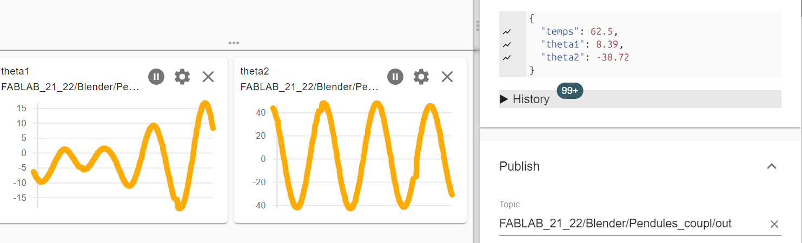

# Blender Pendulum Simulation with MQTT

This project features physical pendulum simulations in Blender 4.x. Angular data is extracted in real-time and sent to an MQTT broker via embedded Python scripts.

---

## 1. Simple Pendulum

**Blender File:** `pendule2.blend`
**Python Scripts:**

* `mqtt_pendule_simple.py`: Main script for MQTT transmission.
* `arret_anim.py`: Script that automatically stops the animation at the end of the sequence.

This scene simulates a single simple pendulum oscillating around an axis.

### Simple Scene Structure (Outliner)

Based on the scene organization:

* **Axe**: Contains the `Cylinder` mesh, serves as the fixed support.
* **Pendule**: Contains `Sphere.001`, this is the moving physical object (Rigid Body).
* **Pivot**: Object serving as the rotation point.

---

## 2. Coupled Pendulums

**Blender File:** `pendule_couple.blend`
**Python Scripts:**

* `mqtt_pend_coupl.py`: Main script for MQTT transmission.
* `arret_anim.py`: Script that automatically stops the animation at the end of the sequence.


This scene simulates two physical pendulums coupled by a torsion spring. The angles theta1 and theta2 are transmitted via MQTT.

### Coupled Scene Structure (Outliner)

The organization of objects in the scene is as follows:

#### The Pendulums (Rigid Bodies)

* **Pendule1**: The first oscillator (contains the Sphere1 mesh).
* **Pendule2**: The second oscillator (contains the Sphere2 mesh).
  * Note: Both objects must have an identical mass to observe consistent beats.

#### The Mounts (Hinges)

These "Empty" objects serve as fixed pivot points.

* **Hinge1**: Rigid Body > Hinge constraint. Connects Pendule1 to the "world" (fixed).
* **Hinge2**: Rigid Body > Hinge constraint. Connects Pendule2 to the "world" (fixed).

#### The Coupling (Torsion Spring)

This element ensures the energy transfer between the two pendulums.

* **couplage**: "Empty" object carrying the Generic Spring constraint.
  * **Configuration:**
    * **Objects:** Connects Pendule1 and Pendule2.
    * **Angular X:** Stiffness enabled.
    * **Linear:** All disabled (Free).
    * **Collisions:** "Disable Collisions" option checked (Essential).

### Physical Settings

To guarantee a realistic simulation and avoid energy loss (involuntary damping), the following settings are applied:

1. **No Friction (Damping):**
    * On Pendule1 and Pendule2 (Physics Tab > Dynamics):
    * Translation: 0.000
    * Rotation: 0.000

2. **Engine Precision (Solver):**
    * In Scene Properties > Rigid Body World:
    * **Substeps per Frame:** 240 (Increases temporal precision).
    * **Solver Iterations:** 30.

### Python Script and MQTT

The `mqtt_pend_coupl.py` script runs on every frame change (`frame_change_post`) to send the real position of the pendulums.

#### Prerequisites

* Python 3.x (the one embedded in Blender).
* `paho-mqtt` library installed in the Blender Python environment.

#### Script Operation

1. **Connection:** Connects to the broker `mqtt.univ-cotedazur.fr` (Port 8443, SSL/TLS) at startup.
2. **Reading:** Retrieves the world matrix (`matrix_world`) of the objects to get the real angle after physical calculation.
3. **Sending:** Publishes a JSON message on the dedicated topic (e.g., `FABLAB_21_22/Blender/Pendule/out`).

**JSON Format:**

```json
{
  "temps": 1.05,
  "theta1": 12.45,
  "theta2": -5.30
}
```


